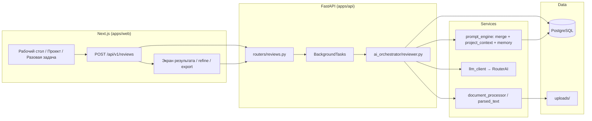

# Архитектура LexForge AI

Корпоративный LegalTech AI-ассистент для юридического отдела (договоры, проекты/дела, консультирование, судебная работа).  
Состоит из **веб-интерфейса (Next.js)** и **API (FastAPI)** — два процесса; общая **PostgreSQL** (+ Redis), файлы в `uploads/`.

API version (health): **0.9.0**. Прототип оптимизирован под локальный запуск (MacBook, Docker только для PG + Redis).

---

## Стек технологий

| Слой | Технологии |
|------|------------|
| **Фронтенд** | [Next.js](https://nextjs.org/) 15 (App Router), TypeScript, Tailwind CSS, Zustand (auth/company), TipTap (превью документов). UI: `apps/web/src/components/`, страницы в `apps/web/src/app/`. |
| **Бэкенд** | Python 3.12–3.13, [FastAPI](https://fastapi.tiangolo.com/), SQLAlchemy 2 (async), JWT (bcrypt). Entry: `apps/api/main.py` → uvicorn. |
| **ИИ** | OpenAI-compatible API через **RouterAI** (`ROUTERAI_API_KEY`, модель Qwen3.x); fallback OpenAI. Клиент: `services/ai_orchestrator/llm_client.py`. |
| **Оркестрация задач** | In-process BackgroundTasks FastAPI (без Celery в прототипе): review, compare, counterparty, legal work, RAG index. |
| **Документы** | python-docx / PDF-парсинг → текст; diff для сравнения редакций; экспорт .docx и annotated .docx с Word comments. |
| **База данных** | **PostgreSQL 16** + **pgvector** (эмбеддинги чанков). Миграции Alembic: `packages/db/migrations/`. |
| **Кэш / очередь (задел)** | Redis 7 в docker-compose (под будущий Celery / сессии; сейчас не обязателен для happy-path). |
| **Хранилище файлов** | Локальная ФС `uploads/` (не MinIO). |
| **Деплой (локально)** | Docker Compose: только `postgres` + `redis`. API и Web — нативно (`make api` / `make web`). |

**Зависимости:** `apps/api/requirements.txt`, `apps/web/package.json`.

**Конфигурация:** `.env` / `.env.example` — `DATABASE_URL`, `REDIS_URL`, `JWT_SECRET`, `ROUTERAI_API_KEY`, `WEB_URL` и др.

**Журнал работ:** `docs/WORK_JOURNAL.md`.

---

## Структура проекта

```
LexForge_AI_App/
├── apps/
│   ├── api/                    # FastAPI: auth, routers, config, database
│   │   ├── main.py             # Точка входа API + /health
│   │   ├── routers/            # REST: reviews, projects, documents, …
│   │   └── schemas_*.py        # Pydantic-схемы запросов/ответов
│   └── web/                    # Next.js UI
│       └── src/
│           ├── app/            # Страницы: dashboard, work, projects, contracts, …
│           ├── components/     # AppShell, панели результатов, сайдбар
│           └── lib/            # api.ts, navigation.ts, store, due-diligence-guide
│
├── packages/db/                # SQLAlchemy models + Alembic
│   ├── models.py
│   └── migrations/versions/    # 001…013 (documents → projects)
│
├── services/
│   ├── ai_orchestrator/        # reviewer, comparator, counterparty, legal_work, merger
│   ├── document_processor/     # parse, ingest, diff, export, annotated_export
│   ├── prompt_engine/          # registry (code-only prompts), project_context/memory
│   └── rag/                    # chunking + indexer (pgvector)
│
├── scripts/                    # seed_data.py и утилиты
├── uploads/                    # Загруженные .docx/.pdf (gitignore)
├── docs/WORK_JOURNAL.md
├── docker-compose.yml          # postgres + redis
├── Makefile
└── .env.example
```

### Ключевые модули UI (маршруты)

| Путь | Назначение |
|------|------------|
| `/dashboard` | Рабочий стол: блоки «Договорная / Судебная / Консультирование» → **Проект** или **Разовая задача** |
| `/work/[section]/project` | Выбор проекта в работе или создание нового |
| `/work/[section]/task` | Выбор инструмента без проекта |
| `/projects`, `/projects/new`, `/projects/[id]` | Список / создание / карточка дела (контекст, инструменты, память, судебный профиль) |
| `/contracts/review`, `/contracts/compare`, `/contracts/create` | Проверка, сравнение редакций, генерация договора |
| `/consulting/*`, `/litigation/*` | Справки, проверка решений, иски, возражения |
| `/counterparty/check` | Due diligence по ИНН (чеклист, без live-реестров) |
| `/settings/prompts` | ~~Управление промптами~~ — отключено; промпты только в коде |
| `/documents` | Картотека документов |

### Ключевые API-префиксы (`/api/v1`)

| Router | Назначение |
|--------|------------|
| `auth`, `companies` | JWT, multi-company |
| `documents` | Upload, parse, картотека, RAG index |
| `reviews` | Проверка договора, refine, export / export-annotated |
| `comparisons` | Сравнение версий |
| `projects` | CRUD дел, from-document, judicial-profile, attach/upload |
| `prompts` | Read-only listing; запись отключена (410) |
| `counterparty` | Проверка контрагента |
| `consulting`, `litigation` | Legal work items |
| `activity` | Единая лента задач |
| `reference_documents` | Опорные шаблоны/чек-листы |

---

## Модель данных (основные сущности)

Хранилище — **PostgreSQL**, не JSON-файлы. Multi-tenancy через `companies` + `user_company_roles`.

| Таблица / сущность | Назначение |
|-------------------|------------|
| `users`, `companies`, `user_company_roles` | Пользователи и доступ к компаниям |
| `documents`, `document_versions` | Картотека и распознанный текст |
| `document_chunks` | RAG-чанки + embedding (pgvector) |
| `document_tasks`, `task_results` | Проверки договора (режим, позиция, multi-agent, `review_context`, `project_id`) |
| `comparison_tasks`, `comparison_results` | Сравнение базовой и новой редакции |
| `projects`, `project_documents` | Дела (matter): kind, stage, brief, `judicial_profile`, `memory_json`, итерации документов |
| `prompt_overrides` | Legacy-таблица; runtime её не использует (промпты из `registry.py`) |
| `reference_documents` | Опорные документы для проверки |
| `counterparty_checks` | Задачи due diligence по ИНН |
| `legal_work_items` | Справки, решения, иски, возражения |
| `deadline_extractions` | Извлечение сроков из договора |

### Проект (`projects`) — накопленный контекст для ИИ

| Поле | Смысл |
|------|--------|
| `kind` | `contract` / `litigation` / `consulting` |
| `stage`, `specificity`, `brief` | Этап сделки и бриф юриста (опционально + мини-опрос в UI) |
| `judicial_profile` | JSON: summary, kad_notes, media_notes, risk_flags, sources, manual_checks |
| `memory_json` | JSON: open_risks, accepted_positions, concessions, closed_issues, notes — обновляется после review/compare |

---

## Как данные проходят через проверку договора (и проект)

UI и API — разные процессы. Задача создаётся через REST; оркестратор читает документ из БД/`uploads`, зовёт LLM, пишет `task_results` и при наличии `project_id` обновляет `memory_json`.

### Схема потока



### Пошагово (проверка в контексте проекта)

1. **Юрист открывает проект** (`/projects/[id]`) или разовую задачу → выбирает «Проверка договора» с `project_id` / `document_id` в query.
2. **Создание задачи** — `POST /api/v1/reviews` → запись `document_tasks` (status `pending` → `processing`).
3. **Оркестратор** — `run_contract_review`: загружает `DocumentVersion.parsed_text`, собирает system/user промпт (`build_review_prompt`), подмешивает `format_project_context` (бриф, судебный профиль, память).
4. **LLM** — single-agent или multi-agent (`result_merger`) → JSON findings + risk_score.
5. **Сохранение** — `task_results`; при refine — merge с `accepted_findings` / `finding_feedback` из `review_context`.
6. **Память проекта** — `update_memory_from_review` обновляет `projects.memory_json`.
7. **UI** — polling статуса → `ReviewResultPanel`: одобрение замечаний, перепроверка, экспорт заключения или **annotated .docx** (Word comments).
8. **Опционально** — «Создать проект» из результата (`POST /projects/from-document`), если задача была разовой.

### Смежные потоки

| Сценарий | Оркестратор / сервис | Куда пишет |
|----------|----------------------|------------|
| Сравнение редакций | `comparator.py` + `diff_engine` | `comparison_results` + concessions в `memory_json` |
| Due diligence по ИНН | `counterparty_checker.py` | `counterparty_checks` + при `project_id` → `judicial_profile` |
| Генерация договора | `contracts` router + store generated | новый `Document` в картотеке |
| Legal work (справка/иск) | `legal_work_runner.py` | `legal_work_items` + export .docx |
| RAG | `rag/indexer.py` | `document_chunks.embedding` |

### Промпты

- **База** — единственный источник: `services/prompt_engine/registry.py` (один подробный промпт на позицию/режим). UI-редактирование отключено; `prompt_overrides` не читаются.
- **Замечания юриста** — только в потоке задачи (refine / finding feedback / lawyer notes) для перегенерации конкретного результата.
- **Позиция в договоре** — `contract_review.position.*` + `$position_instruction`.
- **Due diligence** — чеклист с URL и `how_to_check` (live КАД не подключён; справочник ресурсов в UI).

---

## Запуск локально

### Подготовка

```bash
cd /path/to/LexForge_AI_App
cp .env.example .env
# Укажите ROUTERAI_API_KEY для ИИ-модулей
```

### Рекомендуемый вариант (Docker только для БД)

```bash
make setup          # venv + install + docker up + migrate + seed
```

В двух терминалах:

```bash
make api            # http://localhost:8000  (Swagger: /docs)
make web            # http://localhost:3000
```

Остановка БД: `make down`.

### Демо-аккаунт

| Email | Пароль |
|-------|--------|
| admin@lexforge.ru | admin123 |

При `make seed` создаются демо-компании.

### Проверка здоровья

```bash
curl -s http://localhost:8000/health
```

В ответе — `version` и флаги модулей (`reviews`, `projects`, `multi_agent_review`, …).

### Важно

- API и Web должны видеть один `.env` / одну БД.
- Файлы документов пишутся в `uploads/` относительно корня репозитория.
- После обновления кода API обычно нужен перезапуск `make api` (фоновые задачи и роутеры грузятся при старте).
- Live-интеграции КАД/реестров **нет** — due diligence = чеклист + ручной судебный профиль.

---

## Что сознательно не в прототипе (enterprise-задел)

| Компонент | Статус |
|-----------|--------|
| Celery / Temporal | Отложено; сейчас BackgroundTasks |
| OnlyOffice | Нет; TipTap + server-side OOXML export |
| Keycloak / AD SSO | Нет; JWT email/password |
| MinIO / S3 | Нет; `uploads/` |
| Live КАД / ФНС / ФССП API | Нет; самостоятельный чеклист |
| On-prem LLM | Нет; RouterAI / OpenAI cloud |
